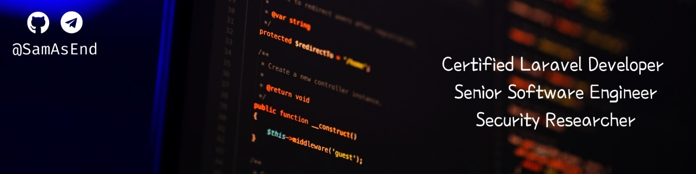

[Certified Laravel Developer](https://exam.laravelcert.com/is/samson-endale-mergissa/certified-since/2021-07-30) with 9+ years of experience, including success in remote teams across Europe and India.  My extensive experience with Laravel is evident in [my contributions](https://github.com/search?q=org%3Alaravel+author%3ASamAsEnd&type=commits) to the Laravel codebase and [packages featured](https://laravel-news.com/search?index=articles&q=SamAsEnd) on Laravel News. I bring a problem-solving approach and a team-oriented mindset to every project, constantly learning and exceeding expectations.

 - [hi@sam.et](mailto:hi@sam.et)
 - [LinkedIn](https://www.linkedin.com/in/SamAsEnd) 
 - [Telegram](https://t.me/SamAsEnd)
